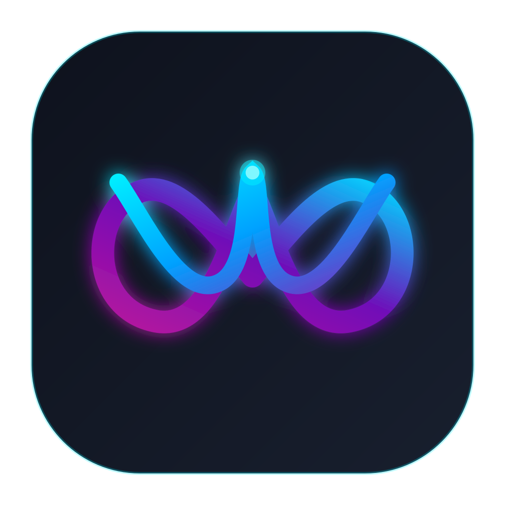

# WVF OF

<p align="center">
  
</p>

<p align="center">
  <b>Современный защищенный кроссплатформенный клиент протокола OpenFlux</b><br>
  Поддержка: <b>Windows</b> • <b>Linux</b> • <b>Android</b>
</p>

---

## Возможности

- **Полная поддержка протокола OpenFlux**: многотранспортные сессии, умный автоматический failover, поддержка прокси и системного VPN/TUN.
- **Новый дизайн**: современная неоновая палитра (Electric Cyan / Midnight Slate), скругленный интерфейс, плавные анимации.
- **Единая кодовая база Compose Multiplatform**:
  - **Windows** (MSI / EXE / Portable) — встроенный драйвер Wintun, системный трей, поддержка горячих клавиш.
  - **Linux** (DEB / Distributable) — интеграция с системным треем и окружением.
  - **Android** (APK) — Android VpnService, встроенный QR-сканер, поддержка SmartCaptcha.

---

## Структура проекта

```
wvf-of/
├── androidApp/    Клиент для Android (VpnService, QR-сканер, сервис уведомлений)
├── desktopApp/    Клиент для Desktop (Windows / Linux / macOS, Compose Desktop)
├── shared/        Общая кодовая база UI, моделей и бизнес-логики (Compose Multiplatform)
├── OpenFlux/      Подмодуль: высокопроизводительное сетевое ядро на Go
└── scripts/       Скрипты сборки ядра для Desktop и Android
```

---

## Сборка

### Требования
- JDK 17 (Eclipse Adoptium Temurin 17)
- Go (версия 1.22+)
- Для Android: Android SDK 35 + NDK 27 + `gomobile`

### Сборка для Desktop (Windows / Linux)
```bash
# Сборка ядра
bash scripts/build-core.sh

# Запуск десктопного приложения
./gradlew :desktopApp:run

# Создание установщиков (MSI, EXE на Windows; DEB на Linux)
./gradlew :desktopApp:packageDistributionForCurrentOS
```

### Сборка для Android
```bash
# Сборка gomobile AAR ядра
bash scripts/build-android-core.sh

# Сборка APK
./gradlew :androidApp:assembleRelease
```

---

## Лицензия
Проект распространяется под лицензией GPL-3.0.
Базируется на сетевом протоколе OpenFlux.
