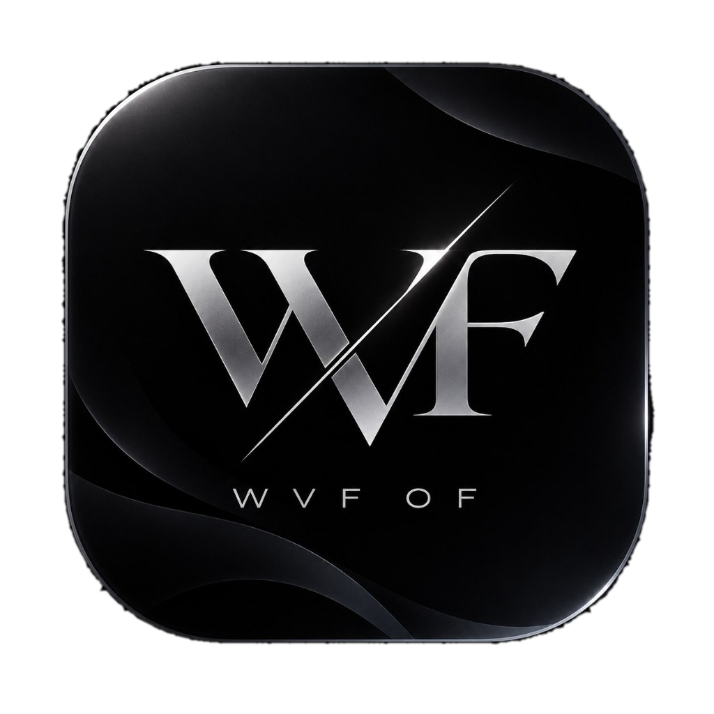

<div align="center">



# WVF OF

**Премиальный, высокоскоростной и защищенный кроссплатформенный клиент сети OpenFlux**

[](https://github.com/VansFenix/WVF-OF/releases/tag/v2.0.0)
[](https://github.com/VansFenix/WVF-OF/releases/tag/v2.0.0)
[](https://github.com/VansFenix/WVF-OF/releases/tag/v2.0.0)
[](https://github.com/VansFenix/WVF-OF/releases/tag/v2.0.0)
[](https://kotlinlang.org/)
[](LICENSE)

<br/>

<p align="center">
  <b>WVF OF</b> — это современный форк клиента протокола OpenFlux с обновленной дизайн-системой, расширенной кроссплатформенной поддержкой (Windows, Linux, Android) и полной изолированностью для возможности совместной работы с оригинальным приложением.
</p>

</div>

---

## 📥 Загрузки и релизы (v2.0.0)

Все готовые сборки доступны для прямой загрузки во вкладке **[GitHub Releases v2.0.0](https://github.com/VansFenix/WVF-OF/releases/tag/v2.0.0)**.

| Платформа | Файл | Размер | Описание |
| :--- | :--- | :---: | :--- |
| **Android (ARM64)** | [**WVF-OF-Android-arm64.apk**](https://github.com/VansFenix/WVF-OF/releases/download/v2.0.0/WVF-OF-Android-arm64.apk) | ~34 МБ | Оптимизировано для 99% смартфонов (ARMv8 / 64-bit) |
| **Android (Universal)** | [**WVF-OF-Android-Universal.apk**](https://github.com/VansFenix/WVF-OF/releases/download/v2.0.0/WVF-OF-Android-Universal.apk) | ~74 МБ | Универсальный APK (ARM64, ARMv7, x86, x86_64) |
| **Windows (Installer)** | [**WVF-OF-Windows-Installer.msi**](https://github.com/VansFenix/WVF-OF/releases/download/v2.0.0/WVF-OF-Windows-Installer.msi) | ~136 МБ | Официальный Windows MSI установщик с ярлыками и треем |
| **Windows (Portable)** | [**WVF-OF-Windows-Portable.zip**](https://github.com/VansFenix/WVF-OF/releases/download/v2.0.0/WVF-OF-Windows-Portable.zip) | ~135 МБ | Портативная версия (распакуйте и запустите `WVF OF.exe`) |
| **Linux (tar.gz)** | [**WVF-OF-Linux-Portable.tar.gz**](https://github.com/VansFenix/WVF-OF/releases/download/v2.0.0/WVF-OF-Linux-Portable.tar.gz) | ~110 МБ | Портативный пакет для Linux x86_64 (включает `run.sh` и ядро) |
| **Linux (zip)** | [**WVF-OF-Linux-Portable.zip**](https://github.com/VansFenix/WVF-OF/releases/download/v2.0.0/WVF-OF-Linux-Portable.zip) | ~110 МБ | ZIP-архив с портативной версией для Linux |

---

## ✨ Ключевые особенности WVF OF

- 💎 **Новая визуальная айдентика**:
  - Премиальный дизайн: темное обсидиановое стекло, металлический хром и неоновые акценты.
  - Адаптивные иконки Android (Adaptive Icons с динамическим фоном и передним планом).
  - Нативные темные темы без устаревших элементов Android 4/5.
- 🔄 **Параллельная установка (Side-by-Side Coexistence)**:
  - Выделенный `applicationId = "io.wvf.of"` для Android — WVF OF можно устанавливать параллельно с оригинальным OpenFlux без конфликтов подписей.
  - Изолированные каталоги данных и профилей на Desktop (`%APPDATA%\WVF OF` и `~/.local/share/WVF OF`) предотвращают конфликты блокировок `instance.lock`.
- 🐧 **Полноценная поддержка Linux**:
  - Встроенный графический бэкенд Skiko Linux x64 и скомпилированное 64-битное ядро Go.
  - Скрипт `run.sh` и файл ярлыка `.desktop` для удобного запуска.
- ⚡ **Передовые возможности протокола OpenFlux**:
  - Многотранспортные туннели с автоматическим выбором маршрута и мгновенным переключением при сбоях.
  - Встроенный полнотуннельный режим TUN / Wintun (L3) и прокси-режимы (SOCKS5 / HTTP).
  - Встроенная поддержка SmartCaptcha и QR-кодов профилей.

---

## 🚀 Руководство по запуску

### Android
1. Скачайте `WVF-OF-Android-arm64.apk` (или универсальный APK).
2. Разрешите установку из неизвестных источников в настройках устройства.
3. Откройте приложение, добавьте профиль через QR-код или ссылку `openflux://` / `wvf://` и подключитесь.

### Windows
- **Установщик**: Запустите `WVF-OF-Windows-Installer.msi` и следуйте шагам мастера установки.
- **Портативная версия**: Распакуйте `WVF-OF-Windows-Portable.zip` в любую папку и запустите `WVF OF.exe`.

### Linux
1. Распакуйте архив:
   ```bash
   tar -xvf WVF-OF-Linux-Portable.tar.gz
   cd WVF-OF-Linux-Portable
   ```
2. Выдайте права на выполнение:
   ```bash
   chmod +x run.sh openflux-linux-amd64
   ```
3. Запустите:
   ```bash
   ./run.sh
   ```
   *(Для работы требуется Java 17+: `sudo apt install openjdk-17-jre`. Для полнотуннельного режима TUN запустите `sudo ./run.sh` или выполните `sudo setcap cap_net_admin,cap_net_bind_service=+ep openflux-linux-amd64`).*

---

## 🛠️ Архитектура и технологии

- **UI Framework**: [Compose Multiplatform](https://www.jetbrains.com/lp/compose-multiplatform/) (Kotlin 2.0+)
- **Core Engine**: [OpenFlux Core](https://github.com/p1neappleXpress/OpenFlux) (Go 1.22+)
- **Сетевой стек**:
  - Windows: драйвер Wintun L3 + локальный системный прокси WinINET
  - Linux: Linux TUN Interface + `iptables` / `nftables`
  - Android: `VpnService` + Go Mobile Bindings
- **Desktop Packaging**: Compose Desktop Gradle Plugin + WiX Toolset v3

---

## 📄 Лицензия

Проект распространяется под свободной лицензией **GNU General Public License v3.0 (GPL-3.0)**.
Оригинальный сетевой протокол и ядро разработаны командой [OpenFlux](https://github.com/p1neappleXpress/OpenFlux).
Форк и оформление: [VansFenix](https://github.com/VansFenix).
